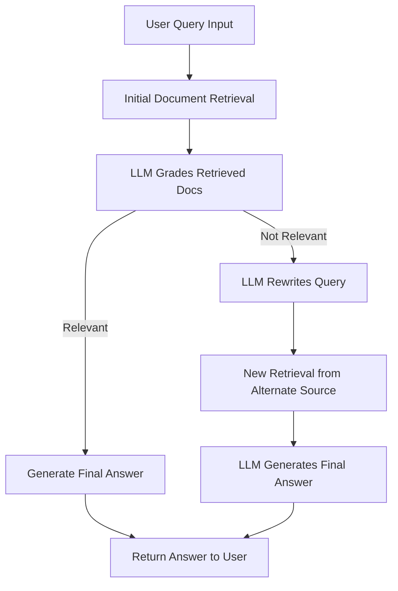

# 🔍 Agentic RAG with IBM Db2

This repository demonstrates how to build an **agentic Retrieval-Augmented Generation (RAG)** workflow using IBM Db2 and the `langchain-db2` connector. The project follows a modular architecture that progresses from a prototype implementation to production-ready microservices, culminating in a unified API gateway.

## 🎯 Use Case Overview

This project implements a fully local, agentic RAG pipeline using **LangGraph** that goes beyond simple vector search by incorporating intelligent agent behavior. The system is designed to:

* **Run entirely locally** on macOS, offline when needed
* **Use local embeddings** with `llama.cpp` and Granite models
* **Perform iterative query refinement** when initial retrieval fails
* **Reason and evaluate context** before generating answers
* **Automatically rewrite queries** for improved retrieval results
* **Grade document relevance** using AI models
* **Provide fallback strategies** for robust operation

The goal is to empower the LLM not just to answer questions, but to **reason**, **evaluate context**, and **adapt its approach** when the initial strategy doesn't yield relevant results.

## 🔁 Agentic RAG Workflow



This agentic loop demonstrates: **query → retrieve → grade → optionally rewrite → final answer**.

## Project Architecture

This repository is designed with modularity in mind, allowing each component to be developed, tested, and deployed independently:

```
agentic-rag-db2/
├── prototype/           # Complete RAG implementation in Jupyter notebook
├── ingestion-api/       # Document ingestion microservice
├── search-api/          # Agentic search and QA microservice  
├── gateway-api/         # Unified API gateway
├── models/              # Shared AI models
├── README.md
└── .env
```

## Components Overview

### `prototype/`
A complete, self-contained Jupyter notebook implementation that serves as the reference for the entire agentic RAG pipeline:

* Document loading and intelligent chunking
* Vector embeddings using local LLM (llama.cpp)
* Vector storage in Db2 using `langchain-db2`
* Semantic retrieval and search
* **Agentic RAG Logic**: Uses LangGraph to orchestrate an intelligent agent workflow that:
  - Analyzes incoming queries for intent and complexity
  - Automatically rewrites queries for better retrieval results
  - Grades document relevance using AI models
  - Makes decisions about when to retrieve more documents
  - Provides fallback strategies for edge cases

**Can be run independently** for experimentation and development.

### `ingestion-api/`
A FastAPI microservice that extracts the document ingestion logic from the prototype notebook into a production-ready API:

* Web document extraction from URLs using Trafilatura
* Intelligent text chunking with sentence-aware splitting
* Local embedding generation using Granite models
* Vector storage in Db2's vector database
* Table management (create, clear, validate)
* Health monitoring and comprehensive error handling

**Can be run and tested independently** as a standalone ingestion service. See `ingestion-api/README.md` for setup instructions and testing with document URLs.

### `search-api/`
A FastAPI microservice that implements the agentic search and question-answering logic from the prototype:

* **Input**: Receives user questions via REST API
* **Agentic Orchestration**: Uses LangGraph to manage a multi-step reasoning workflow:
  - Query analysis and intent detection
  - Automatic query rewriting for improved retrieval
  - Document relevance grading using IBM Watsonx
  - Context-aware answer generation
  - Fallback mechanisms for robust operation
* **Vector Search**: Vectorizes questions and retrieves top matching documents from Db2
* **Output**: Returns contextual answers with source citations

**Can be run and tested independently** as a standalone search service. See `search-api/README.md` for setup instructions.

### `gateway-api/`
A unified API gateway that combines both ingestion and search APIs into a single access point:

* **Single Deployment**: One command starts the complete RAG pipeline
* **Unified Interface**: All operations accessible through one base URL and port
* **Embedded Services**: Automatically loads and runs both ingestion and search APIs
* **No Separate Services**: Eliminates the need to run ingestion-api and search-api separately
* **Production Ready**: Includes proper error handling, health checks, and monitoring

**Default Port**: 8000

### `models/`
Shared directory for local AI models to ensure consistency and reduce storage overhead:

* **Granite Embedding Model**: `granite-embedding-30m-english-Q6_K.gguf` for semantic search
* **Language Models**: Additional models for local inference as needed

## Quick Start

### Prerequisites
* Python 3.13+
* UV package manager
* IBM Db2 database with vector support
* IBM Watsonx account (for agentic search functionality)

### Setup

1. **Configure environment**:
   ```bash
   # Create .env file in root directory
   cp .env.example .env
   # Edit .env with your credentials
   ```

2. **Download models**:
   ```bash
   mkdir -p models
   wget -O models/granite-embedding-30m-english-Q6_K.gguf \
     https://huggingface.co/lmstudio-community/granite-embedding-30m-english-GGUF/resolve/main/granite-embedding-30m-english-Q6_K.gguf
   ```

3. **Start the unified gateway**:
   ```bash
   cd gateway-api
   uv sync
   uv run uvicorn gateway_api:app --reload --host 0.0.0.0 --port 8000
   ```

### Usage Example

```bash
# 1. Ingest a document
curl -X POST "http://localhost:8000/ingest" \
  -H "Content-Type: application/json" \
  -d '{"url": "https://example.com/article", "table_name": "AI_KNOWLEDGE"}'

# 2. Search and get intelligent answers
curl -X POST "http://localhost:8000/search" \
  -H "Content-Type: application/json" \
  -d '{"query": "What is the main topic?", "table_name": "AI_KNOWLEDGE"}'
```

## Development Approaches

### Option 1: Modular Development
Each API can be developed and tested independently:

```bash
# Test ingestion only
cd ingestion-api && uv run uvicorn ingestion_api:app --port 8001

# Test search only  
cd search-api && uv run uvicorn search_api:app --port 8002

# Test gateway (runs both)
cd gateway-api && uv run uvicorn gateway_api:app --port 8000
```

### Option 2: Unified Development
Use the gateway API for simplified development and deployment:

```bash
cd gateway-api
uv sync
uv run uvicorn gateway_api:app --reload --host 0.0.0.0 --port 8000
```

### Option 3: Prototype Experimentation
Start with the notebook for rapid experimentation:

```bash
cd prototype/
# Open and run agent.ipynb in Jupyter
```

## Understanding Agentic RAG

This implementation goes beyond simple vector search by incorporating intelligent agent behavior:

1. **Query Analysis**: The agent analyzes user questions to understand intent and complexity
2. **Dynamic Rewriting**: Automatically improves queries for better retrieval results
3. **Relevance Grading**: Uses AI models to assess document relevance to the query
4. **Adaptive Retrieval**: Makes intelligent decisions about when to fetch more documents
5. **Contextual Generation**: Synthesizes answers using the most relevant retrieved context
6. **Fallback Strategies**: Provides robust handling of edge cases and ambiguous queries

This agentic approach significantly improves answer quality compared to traditional RAG implementations.

## Testing

```bash
# Health check
curl "http://localhost:8000/health"

# Service information
curl "http://localhost:8000/services"

# Test individual services (if running separately)
curl "http://localhost:8001/health"  # ingestion-api
curl "http://localhost:8002/health"  # search-api
```

## When to Use Each Approach

- **Gateway API**: Best for production deployment, simplified development, and unified operations
- **Individual APIs**: Best for microservices architecture, independent scaling, and distributed deployment
- **Prototype**: Best for experimentation, learning the concepts, and rapid iteration

## Roadmap

Planned enhancements as the project evolves:

* **Observability**: Comprehensive logging, metrics, and distributed tracing
* **Authentication**: API security, rate limiting, and access control
* **Scalability**: Performance optimization, caching, and horizontal scaling
* **UI Interface**: Web frontend for document management and interactive search
* **Advanced RAG**: Multi-modal content support, citation tracking, and source verification
* **Container Support**: Docker images and Kubernetes deployment manifests
* **Monitoring**: Real-time performance dashboards and alerting

## About

This project demonstrates how AI agents can intelligently interact with both structured and unstructured data using enterprise databases like IBM Db2. It combines vector search, local embeddings, IBM Watsonx AI, and LangGraph-based agentic orchestration into a cohesive, production-ready RAG pipeline that can be deployed as microservices or a unified gateway service.