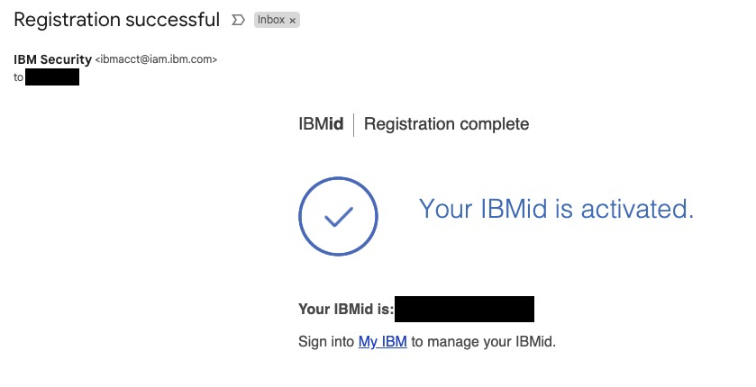

# IDUG LATAM 2025 - Db2 AI Workshop Instructions

## 1. Requesting an IBM id
Go to this page and register for an IBMid: [Create an IBMid](https://www.ibm.com/account/reg/us-en/signup?formid=urx-19776)

You'll you fill in a 2-page form and submit the form. It doesn't require any credit card to get an IBM id. 

Complete page 1 of the IBM id request form and click next. 

After you clicking next on page 1, the registration process will send a 7 digit verification token to the email address you entered on page 1. Copy that token and enter this on the 2nd page of the registration form below and click `Submit`.

Shortly after you'll receive an email such as the following with a confirmation that your IBM id has been created. 

Remember your IBM id and password in a secure place. You'll need them for requesting and accessing a Db2 ML workshop VM. 

It will take a couple minutes to submit the form and get an IBM id. 

Once you have an IBM id and its password, go to the next step. 

## 2. Accessing Your Workshop VM
Go to workshop attendee's page by clicking [this](https://techzone.ibm.com/my/workshops/student/68915e980042a0affcfe084e) 

It will ask you to sign in using your IBM id and password. Enter your IBM credentails and log in. After you reach the Workshop Attendee's page, you will see the following form. In this form, enter the workshop access code that you received from your instructor and click `Submit password/access code` button. 

you'll be taken to the 

Next, this process will assign a workshop VM to your IBM id and direct you to your VM environment page as follows:

On the `Your environment` page, scroll down until you see a section called `VM Remote Console`. Click the blue console link. 

Clicking the blue console link will launch the following login window to your workshop VM. From this window, click `Open in a new window` to open this in a full-size browser tab, which will be easier to work with. 

From this expanded login window, log in as db2inst1 user with the password that your instructor has provided you. 

## 3. Open Visual Studio Code

* 🤖 **Building an Agentic AI Workflow with Db2 + LangChain**
  A two-part tutorial on building a reasoning-capable AI agent using **Db2’s vector search** and the **Db2 LangChain connector**, orchestrated with **LangGraph**:

  → 🎬 **[Part 1: Project Overview + Workflow Explanation](https://video.ibm.com/recorded/134436922)**
  Introduces the Agentic RAG use case, explains how the LLM agent iteratively evaluates, rewrites, and answers queries using vector search, and outlines the full workflow. Ideal for teams modernizing enterprise data access with AI.

  → 🛠️ **[Part 2: Code Walkthrough](https://video.ibm.com/recorded/134451386)**
  Hands-on walkthrough of the Python codebase, showing how to set up the document ingestion pipeline, LangGraph agent, and retrieval logic in a reproducible way.
  📖 [Full tutorial and code](https://lnkd.in/gujc3Wrq)

