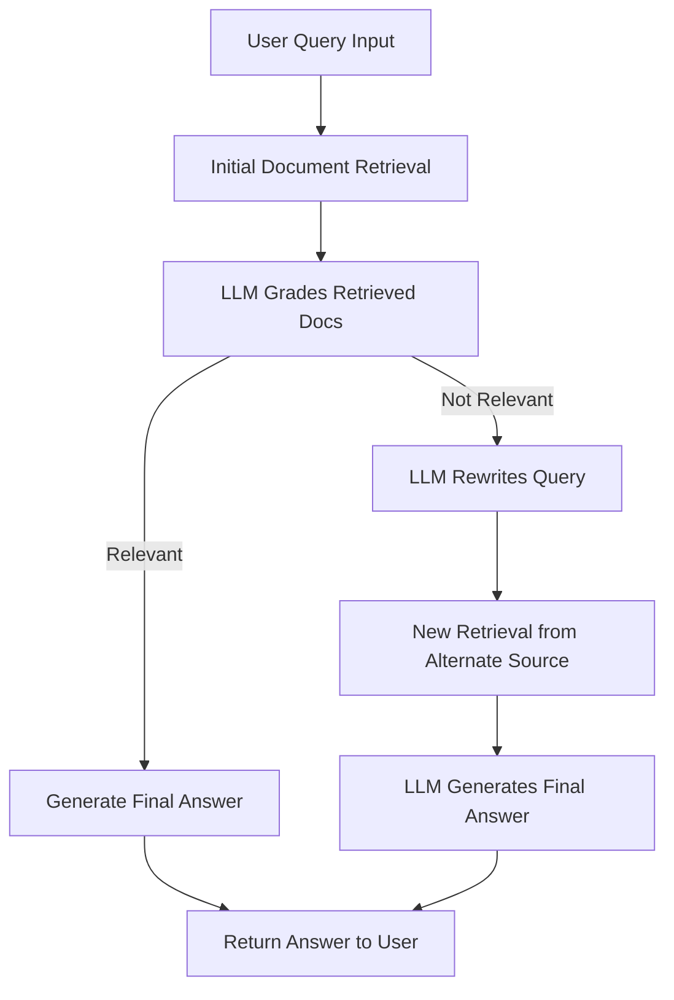

# 🔍 Building an Agentic RAG Pipeline using IBM Db2 and Db2 LangChain Connector - macOS Setup

## 🎯 Use Case

This project implements a fully local, agentic RAG (Retrieval-Augmented Generation) pipeline using **LangGraph**. It is designed to:

* Run entirely on **macOS**, offline
* Use **local embeddings** with `llama.cpp`
* Perform **iterative query refinement** when initial retrieval fails
* Be clean, minimal, and beginner-friendly

The goal is to empower the LLM not just to answer, but to **reason**, **evaluate context**, and **rewrite queries** when needed.

---

## 🔁 Agentic RAG Workflow



This shows the *agentic loop*: query → retrieve → grade → optionally rewrite → final answer.

---

## 🙏 Acknowledgment

This project builds on the excellent LangChain tutorial:  
🔗 [Agentic RAG with LangGraph](https://langchain-ai.github.io/langgraph/tutorials/rag/langgraph_agentic_rag/)

---

## ✨ What I've Added

Compared to the original tutorial, this project includes:

* **Local Embeddings** via `llama.cpp` – no cloud dependency
* **Cleaner Parsing** with `trafilatura` for robust HTML extraction  
* **Smarter Chunking** using sentence-aware segmentation

---

# ⚙️ Setup Instructions (macOS)

## Prerequisites

Ensure you have Python 3.13 and `uv` installed:

```bash
# Install uv if not already installed
curl -LsSf https://astral.sh/uv/install.sh | sh
```

## ✅ Create Virtual Environment and Install Dependencies

```bash
uv venv --python $(which python3.13)
uv pip install -r requirements.txt
```

## 🔐 Create `.env` File

```bash
touch ../.env
```

Add the following to your `../.env` file:

```env
WATSONX_PROJECT=your_project_id_here
WATSONX_APIKEY=your_api_key_here
DB_NAME=your_database_name
DB_HOST=your_database_host
DB_PORT=50000
DB_PROTOCOL=TCPIP
DB_USER=your_username
DB_PASSWORD=your_password
```

Replace the values with your actual Watsonx and IBM Db2 credentials.

## 🧠 Install spaCy Language Model

```bash
uv pip install pip
.venv/bin/python -m spacy download en_core_web_sm
```

## ⬇️ Download Local Embedding Model

```bash
mkdir -p ../models
wget -O ../models/granite-embedding-30m-english-Q6_K.gguf \
  https://huggingface.co/lmstudio-community/granite-embedding-30m-english-GGUF/resolve/main/granite-embedding-30m-english-Q6_K.gguf
```

---

## 💻 Optional: VS Code + Jupyter Setup

### Install Jupyter

```bash
uv pip install jupyter ipykernel
```

### Register Jupyter Kernel

```bash
.venv/bin/python -m ipykernel install --user --name=agentic-rag --display-name "Python (Agentic RAG)"
```

### Set Up in VS Code

1. `Cmd + Shift + P` → **Python: Select Interpreter**
2. Press `Cmd + Shift + .` to show hidden `.venv` folder
3. Choose `.venv/bin/python`
4. `Cmd + Shift + P` → **Jupyter: Select Interpreter to Start Jupyter Server**
5. Choose the same `.venv` Python
6. If kernel doesn't show up:
   * Temporarily select a different one
   * Re-select `.venv`
   * Run `Developer: Reload Window`

---

## 🗂️ Project Structure

```
parent_directory/
├── models/                 # Local models directory (shared)
│   └── granite-embedding-30m-english-Q6_K.gguf
├── .env                    # Environment variables (shared)
└── prototype/
    ├── .venv/              # Virtual environment
    ├── requirements.txt    # Python dependencies
    └── agent.ipynb      # Your main application
```

---

## 🔧 Troubleshooting

### Virtual Environment Issues
If you encounter issues with the virtual environment:
```bash
rm -rf .venv
uv venv --python $(which python3.13)
uv pip install -r requirements.txt
```

### Model Download Issues
If the wget command fails, you can manually download the model:
1. Visit: https://huggingface.co/lmstudio-community/granite-embedding-30m-english-GGUF
2. Download `granite-embedding-30m-english-Q6_K.gguf`
3. Place it in the `../models/` directory (parent folder)

### spaCy Model Issues
If spaCy model installation fails:
```bash
uv pip install pip
.venv/bin/python -m spacy download en_core_web_sm
```